LEERAN BIEN JASJSJS 

ENDPOINTS
LISTAR TODOS LOS EMPLEADOS
GET http://localhost:3001/api/empleados

Obtener empleado por CI
GET http://localhost:3001/api/empleados/{ci}
GET http://localhost:3001/api/empleados/1003484936

CREAR
POST http://localhost:3001/api/empleados
Content-Type: application/json
******ejemplo******
{
  "ci": "0102030405",
  "id_a": 1,
  "id_t": 1,
  "id_b": 1,
  "id_ba": 1,
  "nombres": "Juan",
  "apellidos": "Perez",
  "direccion": "Av. Siempre Viva",
  "telefonos": "0999999999",
  "correo": "juan@correo.com",
  "fecha_nacimiento": "1999-01-01",
  "fecha_ingreso": "2024-01-01",
  "fecha_contrato": "2024-01-01",
  "salario": 500.50,
  "clave": "1234"
}
***********************

ACTUALIZAR
PUT http://localhost:3001/api/empleados/{ci}
PUT http://localhost:3001/api/empleados/1003484936
********ejemplo***********
{
  "direccion": "Nueva dirección",
  "salario": 650.00,
  "clave": "nuevaClave"
}
*************************

Eliminar

DELETE http://localhost:3001/api/empleados/{ci}
http://localhost:3001/api/empleados/1003484936

## Arquitectura del Sistema

```mermaid
---
config:
  look: neo
  theme: redux
  layout: dagre
---
flowchart TB
 subgraph CLIENTE["📱 CLIENTE"]
        A["Postman"]
  end
 subgraph ROUTES["🛣️ CAPA DE RUTAS"]
        B["empleado.routes.ts"]
  end
 subgraph CONTROLLER["🎮 CAPA DE CONTROL"]
        C["EmpleadoController<br>- listar<br>- obtener<br>- crear<br>- actualizar"]
  end
 subgraph SERVICE["⚙️ CAPA DE NEGOCIO"]
        D["EmpleadoService<br>- listar<br>- obtenerPorCi<br>- crear<br>- actualizar"]
  end
 subgraph REPOSITORY["💾 CAPA DE DATOS"]
        E["EmpleadoRepository<br>- findAll<br>- findByCi<br>- create<br>- update"]
  end
 subgraph DATABASE["🗄️ BASE DE DATOS"]
        F[("PostgreSQL<br>Tabla: empleado")]
  end
 subgraph CONFIG["⚙️ CONFIGURACIÓN"]
        G["database.ts<br>Pool Connection"]
  end
 subgraph MODEL["📋 MODELO"]
        H["Empleado.ts<br>Interface"]
  end
    A -- HTTP Request<br>(GET/POST/PUT) --> B
    B -- Define endpoint --> C
    C -- Maneja req/res --> D
    D -- Lógica de negocio --> E
    E -- SQL Query --> G
    G -- Connection Pool --> F
    E -. Usa estructura .-> H
    F -- Rows --> E
    E -- Mapea datos --> H
    H -- Empleado[] --> E
    E -- Promise --> D
    D -- Result --> C
    C -- JSON Response<br>(200/201/404/500) --> A

    style A fill:#e1f5ff,stroke:#0366d6,stroke-width:2px
    style B fill:#fff3cd,stroke:#ffc107,stroke-width:2px
    style C fill:#d4edda,stroke:#28a745,stroke-width:2px
    style D fill:#cce5ff,stroke:#007bff,stroke-width:2px
    style E fill:#f8d7da,stroke:#dc3545,stroke-width:2px
    style F fill:#d6d8db,stroke:#6c757d,stroke-width:3px
    style G fill:#e2e3e5,stroke:#6c757d,stroke-width:2px
    style H fill:#d1ecf1,stroke:#17a2b8,stroke-width:2px
```

